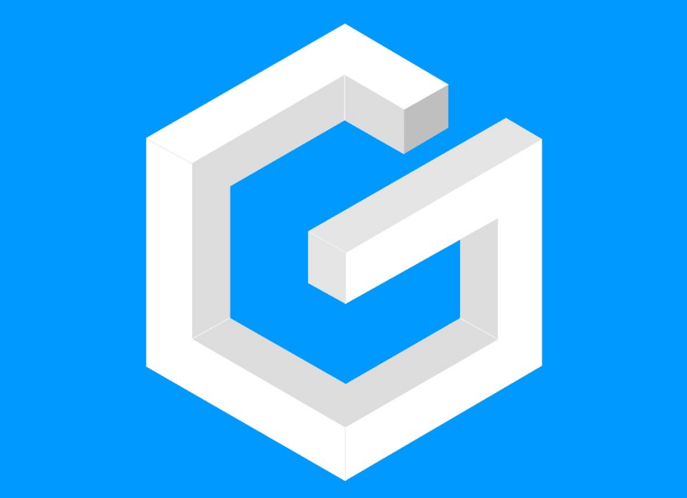
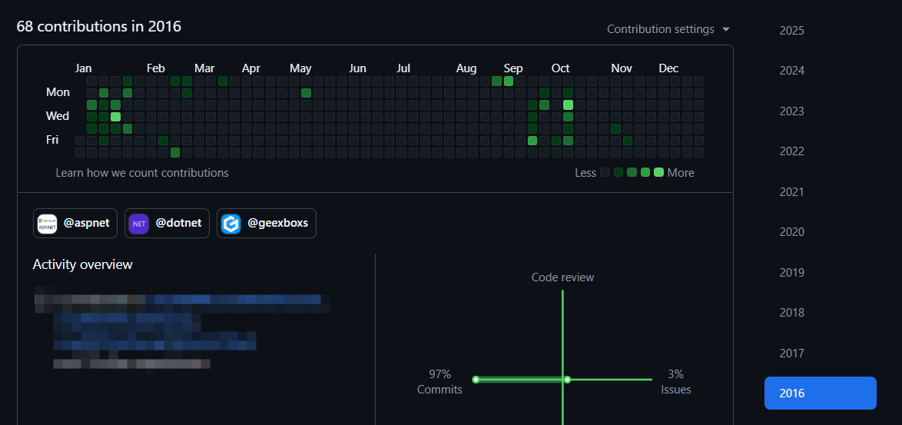
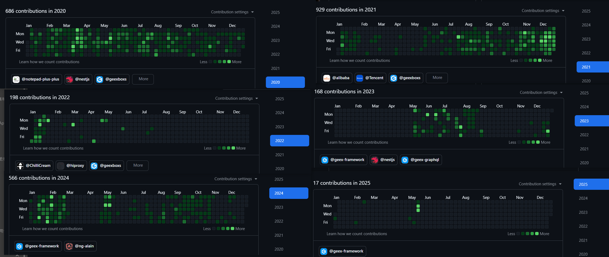

# Geex：道阻且长的开源之路

> 我想在工作之余, 为开源世界做出一点微小的贡献. 
> 
> 👉 项目地址：[github.com/geex-framework/geex](https://github.com/geex-framework/geex)

---



---
## 1. 梦想的起点：牛马搬砖的痛与对最佳实践的渴望

在我深入体会多年国内软件的开发生态的过程中, 我逐渐发现了一个残酷的现实：

**众多优秀的开发者被困在"营养不良"的代码海洋中逐渐麻木成为了牛马, 在各种复杂的"屎山代码"束缚下挣扎前行.**

这不仅仅是技术问题, 更是一种集体的困境. 

### 那些痛的领悟

时下流行着很多的开发框架SpringBoot、Asp.Net、Django、Flask、Ruby on Rails等, 它们提供了无限的可能性. 

但是, 由于开发者技术背景的不统一, 同时随着项目复杂度增加, 这种无限的可能性似乎开始引发了一种混乱. 

微服务、三层架构、DDD、MVC、ORM、IOC、AOP等概念交织, 
各种网关、子服务、Service、Provider、Manager、Repository、Controller、UnitOfWork、Authentication、Authorization等实现混杂, 
因为框架缺乏统一的最佳实践, 团队成员在各自引入新功能时各自“hack”. 

最终, 一个看似简单的功能实现, 背后可能隐藏着好几个微服务或者引用项目的调用链, 混杂了N种风格的代码；
系统成为了混沌, debugging变成了考古, 我们越来越不敢改动代码, 甚至懒得再去理解代码, 
我们疲于应付各种配置问题、数据异常, 调试一整天到处埋点只为分析一个调用链, 
取巧变成了对付Deadline的唯一手段, 我们开始“理解”“屎山”, 最终加入了“屎山”. 

而且, 似乎, 这种状况已经被许多人视为"正常", 仿佛软件开发本该如此繁杂和痛苦. 

### 对最佳实践的渴望

每当我为了实现一个简单功能而编写大量模板代码, 捏着鼻子复制粘贴各种配置各种Service各种Get、Set方法时, 一种强烈的不公感就会涌上心头. 

**编程应该是创造的过程, 而不是无尽的劳动, 我们应该享受创造的乐趣, 而不是受困于繁琐和重复. **

这种矛盾日积月累, 我开始思考：是否有可能创造一个真正以开发者体验为中心的框架？

- 它自带全功能的最佳实践的范例, 能让初中级开发者也能就地开码. 
- 它能让我们用更少的手写代码实现更多的功能, 可以通过简单的配置来实现复杂的业务逻辑. 
- 它有开箱即用的各种功能模块, 引入它们不需要复杂的配置和编码. 
- 它不囿于三层架构, 自带项目引用的模块化, 也可以部署为微服务且无需修改代码. 
- 它一键部署, 不再需要繁琐的环境搭建. 

这就是Geex诞生的原点, 它源于"Geek", 我用"x"替换了"k", 寓意着打破常规, 探索技术的无限可能——它是我对现状的不满, 是我对最佳实践的渴望. 

## 2. Geex的核心理念：让开发者放弃“思考”

当我开始设计Geex时, 我只有一个想法, 作为开发者, 要觉得“爽”, 这种“爽”来源编码时的不假思索, 所谓“放弃思考”. 

### 不需要思考这个文件该放在哪个文件夹

在传统开发中已有的所谓模块化开发设计, 随着项目的增长, 代码库往往会扁平地扩展一系列的文件夹, 
它们之中既有**能力模块**(Logging/Localization/Caching...)也有**业务模块**(Order/Product/Shipping...), 最后两者互相混杂, 新加入的开发者需要数周时间才能理解代码组织方式. 

于是我把所有的能力模块都独立到了项目以外, 统一封装成了`Package`, 同时对业务模块尽量采用了自解释的项目结构：

```
BusinessModule/          // 业务模块
  ├── Core/              // 核心业务逻辑
  │   ├─ Aggregates/     // 领域逻辑定义(后端逻辑)
  │   ├─ GqlSchemas/     // Gql接口定义(前端逻辑)
  │   ├─ Permissions/    // 权限定义(能力使用)
  │   ├─ Settings/       // Setting定义(能力使用)
  │   ...                // 其他能力使用
  ├── Server/            // 业务模块作为微服务启动时的服务入口
  └── Tests/             // 测试代码
```

因为篇幅有限无法精确到每个具体的项目文件, 详细的项目结构可以参考[B站视频](https://www.bilibili.com/video/BV1QF4m1u7iB/), 并自行生成项目测试. 

### 不需要思考前端需要哪些字段, GraphQL解君愁

在技术选型上, 我决定做一些不一样的尝试. 

传统REST API已经成为大多数开发者的默认选择, 但它的局限性也越来越明显：前端常常需要多次请求才能获取所需数据, API版本管理复杂, 文档维护成本高. 

我选择了GraphQL作为API层的核心技术. 它允许前端精确描述所需数据结构, 一次请求即可获取所有数据, 同时还自带文档和类型检查. 
我记得第一次在Geex中实现一个复杂的嵌套查询, 十几行GraphQL查询替代了原本需要多个REST API和大量后处理代码的场景, 那种畅快感让我确信这是正确的选择. 

### 不需要思考数据库字段用什么类型, MongoDB解君愁

存储层面, MongoDB的文档模型与业务对象的自然映射消除了传统ORM中的"阻抗不匹配"问题. 
不再需要复杂的表关系设计, 不再需要繁琐的JOIN查询, 业务对象可以直接序列化存储, 这大大简化了数据访问逻辑. 
同时Geex提供了强力的对MongoDB的"EntityFramework", 在性能不变的情况下实现了EF Core的几乎所有功能, 甚至提供了更强大的LINQ查询能力. 

### 不需要思考新建模块的成本, 模块生成器解君愁

Geex致力于消灭一切可能重复的配置、代码. 

- 创建一个模块只需要一个插件命令, 所有的API、权限、配置、数据模型、业务逻辑都可以自动生成, 生成出来的模块在包含增删改查所有功能的前提下不超过200行代码, 整体代码的MaintainabilityIndex超过92. 
- 平均构造函数注入依赖不超过两个
- 所有的配置都带有一个直观的默认值, 不需要显式配置

这样的代码结构让业务逻辑清晰可见, 每个操作的权限需求和数据流动一目了然. 
更重要的是, 这种模式天然支持单元测试, 提高了代码质量和可维护性. 

### 不需要死记硬背字符串权限码, 枚举解君愁

权限控制常常是企业应用的痛点. 传统方案要么过于简单无法满足复杂业务需求, 要么过于复杂难以维护. 在Geex中, 我设计了一种基于枚举的权限系统, 开发人员不需要在文档中检索权限字符串, 只需使用枚举类型即可：

```csharp
// 集中定义模块权限
public class OrderModulePermission : AppPermission<OrderModulePermission>
{
    public OrderModulePermission(string value) : base($"orderModule_{value}")
    {
    }


    public class OrderPermission : OrderModulePermission
    {
        public static OrderPermission Query { get; } = new("query_order");
        public static OrderPermission Edit { get; } = new("mutation_editOrder");

        public OrderPermission(string value) : base(value)
        {
        }
    }
}
```

权限定义与使用分离, 让权限控制成为系统即插即用的功能, 而不是事后在每个方法内增加一个`if`的附加物. 
这种方式还支持权限的可见性控制和继承关系, 甚至支持单个字段级别的权限控制, 满足了从简单到复杂的各种权限场景需求. 

### 不需要考虑后端是否支持哪些字段, 契约自动生成解君愁

Geex不仅关注后端开发体验, 还延伸到了前端. 基于Angular和Apollo客户端, Geex实现了前后端模型的自动同步, API的自动生成, 甚至连权限控制也能够无缝传递到前端UI层. 

当一个后端开发者添加了新的API时, 前端开发者可以立即看到类型安全的接口定义和完整的文档. 这种体验让全栈开发变得前所未有的流畅. 

### 不需要考虑环境不一样跑不起来怎么办, 容器化解君愁

最后, Geex通过一系列脚本和配置, 实现了从开发环境搭建到生产部署的全流程自动化. 初始化工作区、切换引用类型、容器化部署, 这些原本繁琐的任务都被简化为单个命令, 同时和vscode深度集成, 你甚至不需要使用命令行. 

这种"一键式"体验不仅提高了开发效率, 也大大降低了新团队成员的入门门槛和运维的复杂度. 

### 不需要考虑多租户怎么实现, 数据过滤怎么搞, 异步任务怎么弄...好吧, 都有...

## 3. 从 0 到 0.25：技术难点与隐藏的坑

从最初的构想到第一个可以在生产环境使用的版本, 这条路比我想象中要崎岖得多. GraphQL与MongoDB这对"神仙组合"虽然强大, 却也藏着无数的技术陷阱. 

### MongoDB的表达式树地狱

针对MongoDB, 我做梦也没想到会掉进表达式树的兔子洞. 本以为只是简单地转换几个查询, 结果发现LINQ表达式树的解析比我想象的复杂十倍：

```csharp
// 看似简单的LINQ查询
var query = entities.Where(x => x.Name.Contains("test") && x.Age > 18)
                   .OrderBy(x => x.CreationTime)
                   .Select(x => new { x.Id, x.Name })
                   .Skip(10)
                   .Take(5);

// 背后是复杂的表达式树解析和转换逻辑
// 无数个夜晚就在这里消失了...
```

为了支持这样的查询转换为MongoDB的聚合管道, 我不得不钻研表达式树的每一个细节, 甚至为了实现一个小功能熬夜到凌晨是家常便饭. 总代码量？数万行, 而且大部分都是极其晦涩的逻辑, 为此增加了几百个测试用例. 

现在它会被翻译成MongoDB的聚合管道, 支持复杂的查询、排序、分页

```jsonc
// 转换后的MongoDB聚合管道
[
  { "$match": { "Name": { "$regex": "test" }, "Age": { "$gt": 18 } } },
  { "$sort": { "CreationTime": 1 } },
  { "$skip": 10 },
  { "$limit": 5 },
  // { "$project": { "Id": 1, "Name": 1 } } // 这后面有更多的细节
]
```


### GraphQL的DataLoader魔法与代价

在GraphQL层面, N+1查询问题曾让我头痛不已. 一个看似简单的嵌套查询可能导致数据库被疯狂访问：

```graphql
# 这个查询可能导致数据库炸裂
{
  departments {
    name
    employees {
      name
      projects {
        name
      }
    }
  }
}
```

为了解决这个问题, Geex实现了一套基于表达式树的LazyLoad和BatchLoad机制. 
这套机制能自动合并相关查询, 将N+1查询转化为少量批量查询, 性能提升达到了数十倍. 
实现它的过程？又是无数个"我为什么要自找苦吃"的夜晚. 

终于, 现在它可以通过一个简单的调用链来实现：

```csharp
var entities = dbContext.Departments
    .BatchLoad(x => x.Employees)
    .ThenBatchLoad(x => x.Projects);
```

### class枚举与类型安全的胜利

最让我满意的是一套自建的class枚举生态系统. 在传统框架中, 权限检查、配置项、常量定义常常散落在字符串常量中, 导致重构噩梦：

```csharp
// 传统方式：字符串魔法值
if (HasPermission("system:user:edit")) { ... }

// Geex方式：强类型枚举
if (HasPermission(SystemPermissions.User.Edit)) { ... }
```

当重构一个大型项目时, 第一种方式几乎无法保证所有引用都被正确修改, 甚至还有更恐怖的字符串拼接, 而第二种方式, 相信编译器会成为你最好的朋友. 

## 4. 从 0.25 到 0.5：小圈子里的成功时刻

构建Geex的过程, 是我与那些日常开发痛点不断对话的过程. 每一个设计决策背后, 都有无数次"如果框架能这样做就好了"的场景驱动. 

当我最终完成第一个可用版本并在组内成功推广时, 

>“啊? 只需要引用项目, 接口就可以直接用了吗? 不需要配路由吗? 我擦!?”

>“啊? 生成器生成完了就可以直接跑起来调增删改查了吗? 我擦!?”

>“啊? 这个枚举是自动生成的? 前端怎么什么代码都没写就可以用这个枚举啦? 不用拷贝一份吗? 我擦!?”

>“啊? F1一下就全跑起来啦? 不需要配一下数据库和Redis? 我擦!?”

>“啊? 直接就能用https啦? 我擦!?”

>“啊? ... 我擦!?”

在大家不断的感叹中, 我获得了前所未有的满足...

### 实战案例："加速"一个迭代

当然, 框架的真正价值在于实际项目中的应用. 有一次我们接到一个紧急需求：给公司的客户管理系统增加一个完整的订单追踪模块, 从前端到后端的集成估时3周, 但实际只给了1周的时间. 

**传统开发流程可能是这样的：**
1. 创建项目并设计数据库表结构（1天）
2. 后端编写REST API接口（1天）
3. 前后端根据沟通接口（贯穿始终...）
4. 后端编写实体类和映射配置（1天）
5. 后端实现仓储层和服务层并部署到dev环境（2-3天）
6. 前后端联调（1天）

*每一次前后端的沟通都可能导致接口变更, 需要更新接口文档、重新发布dev环境, 甚至需要手动更新数据库表结构.*

**而使用Geex实际走的流程是：**
1. 后端执行生成器命令创建订单追踪模块（10分钟）
2. 后端定义新的实体类, Gql自动更新接口字段（4小时）
3. 前端直连后端开发机(得益于Geex独特的基于SwitchHosts的开发时域名解析), 即时获取最新的类型提示开始开发（无需等待）
4. 后端根据业务需求完善逻辑（1天）
5. 前后端联调（1天）

*前端开发可以立即看到后端最新的API定义, 按需读取实体的字段, 不需要等待接口文档, 不需要等待dev环境发布, 不需要考虑数据库结构变更.*

产品经理原本已经做好了延期的准备, 结果前端在第一天就根据最新的类型提示开始开发, 后端3天就完成了全部开发, 包括测试. 工作量只有传统开发流程的1/3. 

后续, 当客户突然要求在现有表格中增加几个字段时, 从提需求到生产环境上线仅用了半天时间, 甚至不需要前端开发参与修改. 

这种效率提升不是靠加班, 而是通过消除了传统开发中各种不必要的摩擦和冗余. 

## 5. 目标: 0.5 到 1 , 社区推广的坎坷之路

站在象牙塔外, 我决定把Geex推向更广阔的舞台. 毕竟, 再好的工具, 如果只关在一个团队的小圈子里, 也只是一段孤芳自赏的代码罢了. 

我熬了好几次夜, 编写了一份我认为还算详尽的文档（虽然回头看确实有点混乱）, 准备了好些示例和快速入门教程, 添加到了文档里面. 

过了好久, 终于下定决心, 录制上传了第一个介绍Geex的视频, 期待着评论区的技术交流. 结果——100播放, 3个赞, 0条评论. 

再接再厉, 第二个视频展示了如何快速实现一个全栈CRUD, 成绩更"惊人"：80播放, 1个赞. 

这感觉就像你辛辛苦苦做了一桌丰盛的饭菜（好吧可能也不算丰盛）, 结果没人来吃. (忙~ 都忙~ 忙点好啊~)

我反思了很久：是不是视频做得太差？是不是介绍得不够清楚？还是说, 我其实没必要推广这么一个框架？

> 当然如果你好奇这个框架到底是什么样, 可以看看B站上那个孤独的视频：[《从≈零开始：Geex Start》](https://www.bilibili.com/video/BV1QF4m1u7iB/)

## 6. 至暗时刻与重燃希望

人生不会只有代码, 工作变动、生活琐事还有新项目上线——这些都成了Geex发展路上的绊脚石. 我曾想过放弃, 毕竟一个没什么人关注的开源项目, 似乎不值得投入那么多心血. 

Geex的代码仓库慢慢积灰, 提交记录从每天数次变成了一两个月才一次. 有时打开项目, 看着那些还想完善的功能设计, 却不知从何处继续. 

直到最近, 当我处理一个复杂的业务需求时, 不得不再次面对那些我曾试图用Geex解决的老问题：重复的配置、混乱的代码组织、难以维护的权限系统...

于是我重新打开了尘封的Geex的项目, 从那边拷贝了一两个功能片段, 只能说Geex里面的代码还有些参考意义, 至少对我而言是如此. 

时间可能是最大的敌人, 但是我想重拾代码的激情, 就像是30多岁的中年男人下班打两把游戏, 虽然老是对线被杀成0-2然后龟塔, 但还是会忍不住想要继续玩下去. 

## 7. 向风车挑战的未来之路

每一个开源项目背后, 都有一个不断与自我怀疑搏斗的开发者. 这条路上没有终点, 只有不断的迭代和改进. 

Geex的故事并不特别, 但它承载了我对软件开发应有模样的理解和追求. 搞开源的大多数人都是些许疯狂的堂吉诃德, 可能背着房贷供着家庭, 对抗着那些看似不可战胜的现实风车, 顺便希望能为这个世界做出一点微小的贡献. 

### Geex的未来规划

回顾过去的迭代历程, 我对Geex的未来有了更加务实的规划：

1. **功能优化**：继续完善Geex, 更多的功能, 更爽的用法, 更好的性能, 更少的bug...
   
2. **文档建设**：重构官方文档, 提供更详细的入门教程和示例代码, 特别是针对从传统框架迁移的场景
   
3. **示例项目**：构建一个完整的企业级应用示例, 涵盖从权限管理到工作流、报表等典型企业场景
   
4. **工具链完善**：增强VSCode插件和相关工具链, 进一步简化开发流程
   
5. **社区建设**：构建更多的交流渠道, 收集反馈和贡献

### 如何参与Geex

如果你读到这里, 对Geex产生了一丝兴趣, 我非常欢迎你以各种方式参与进来：

- **尝试使用**：创建一个小项目尝试Geex, 体验其开发流程 ([快速开始指南](https://github.com/geex-framework/geex))
- **各种建议**：不管是对这篇文章, 还是对Geex, 还是对我, 欢迎各种建议
- **贡献代码**：帮助完善文档、修复bug或实现新功能
- **点赞支持**：如果Geex帮你解决了问题或者这篇文章为你提供了某些解题思路, 不妨点赞或者Star支持一下

也许Geex永远不会成为某知名框架, 但对我来说, 它几乎陪伴了我的整个程序员生涯, 也已经成功地改变了某几个开发者的编码体验, 这或许就是开源项目们最大的意义. 



> 从16年毕业开始, 这些年的记录里始终有一个蓝色背景的G

最后, 感谢花时间阅读这篇文章的你. 

我是Lulus, 祝你幸福, 顺便祝你的代码永远优雅无Bug. 
