- 领域模型: https://www.edrawsoft.cn/viewer/public/s/b6b27266069576
- 整体编码流程
    - 后端
        - 后端生成模块
            - 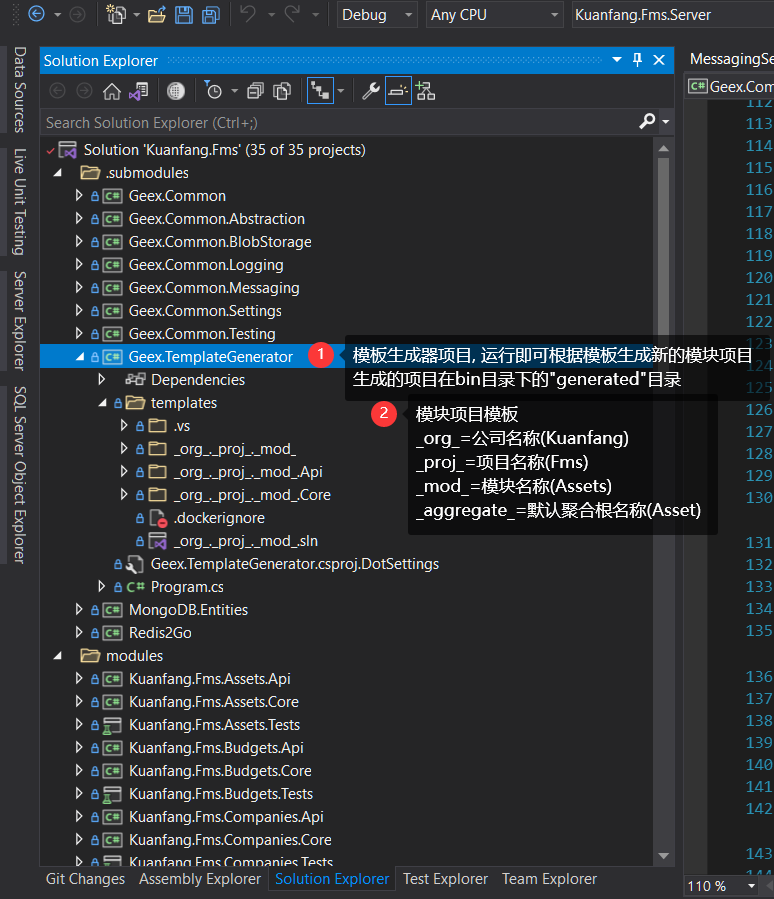
        - 后端定义接口/聚合及实体/功能Request及Handler
            - 项目整体结构
                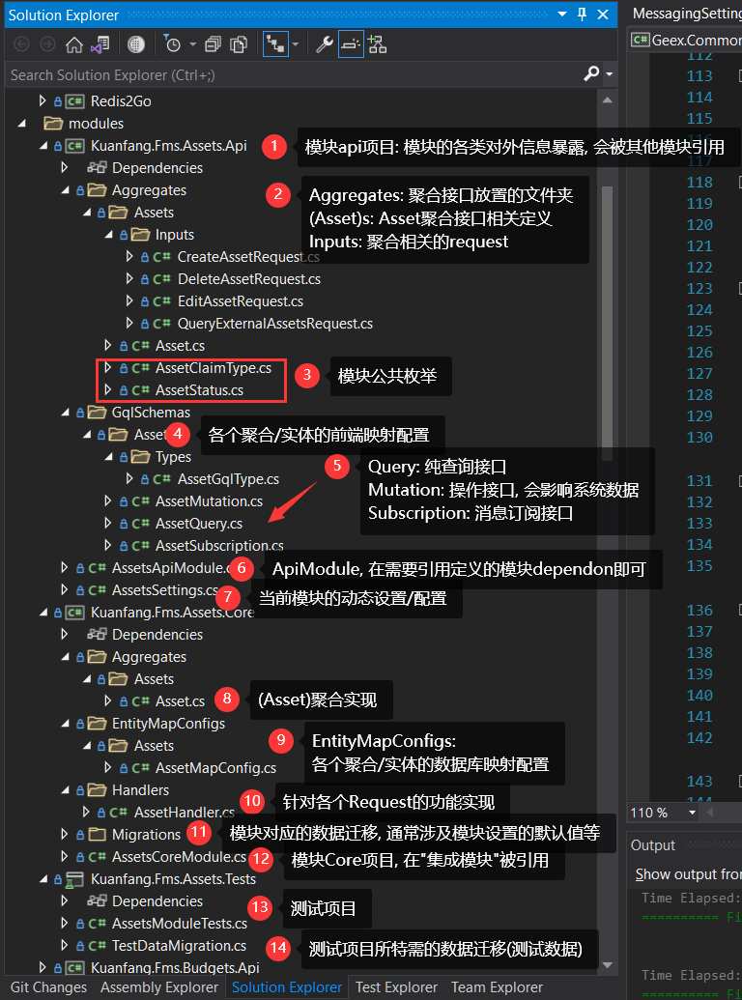
            - 定义接口
                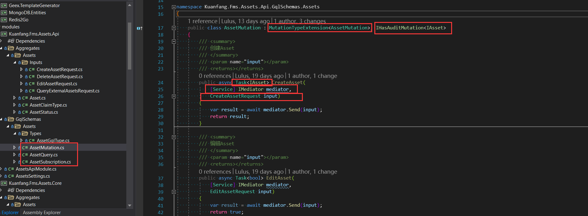
            - request定义
                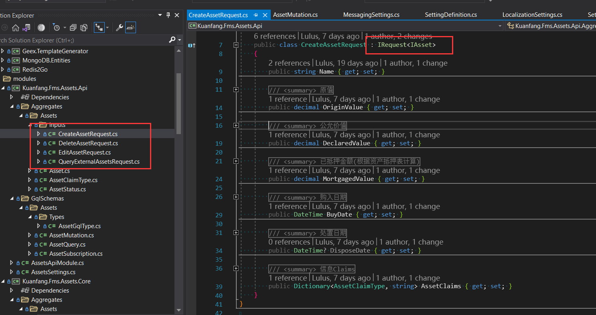
            - graphqlType定义(entity前端映射/dto)定义
                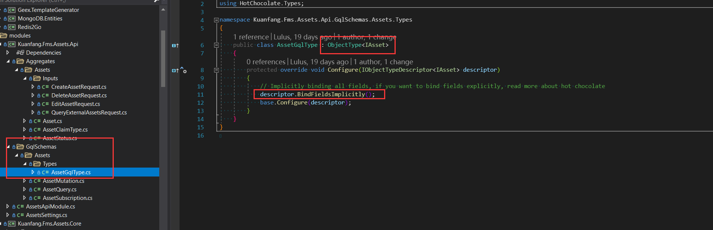
            - 实现Handler
                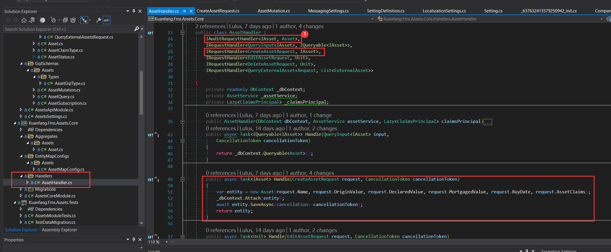
                - 新增entity: new => attach(新版本开启uow的情况下不需要手动save)
                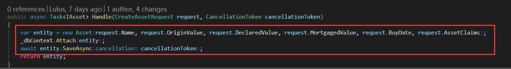
                - 编辑entity: queryable\<xxx> => oneAsync(\<id>)/where(\<filter>) => 任意操作
                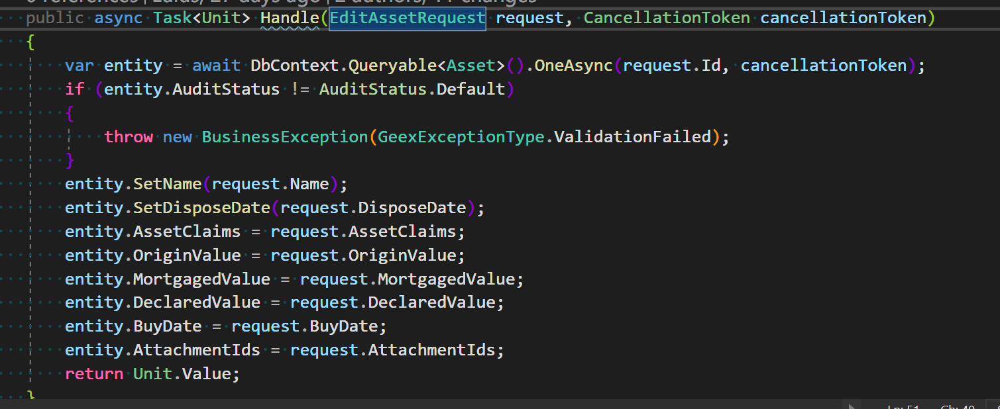
                - 删除entity: delete(\<ids>)
            - 编写测试
                - 构造测试所需的数据
                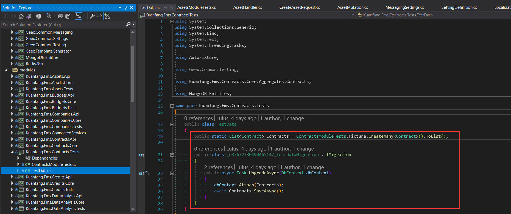
                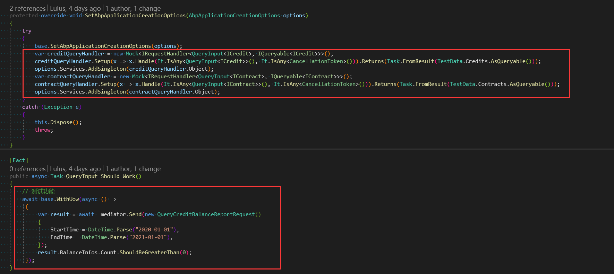
    - 前端
        - 前端项目初始化: yarn
        - 前端项目启动: yarn start
        - 前端模板生成, 参见https://ng-alain.com/cli/generate/zh
            - yarn ng g ng-alain:module messaging
            - yarn ng g ng-alain:list messages/list --module messaging
            - yarn ng g ng-alain:view messages/view --module messaging --modal=false
            - yarn ng g ng-alain:edit messages/edit --module messaging --modal=false
        - 前端定义接口
            - 编写并测试接口调用
                - http://localhost:8000/graphql/
                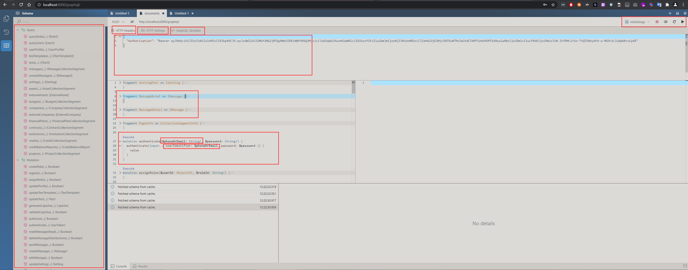 
            - 生成前端代理(yarn gqlgen)
                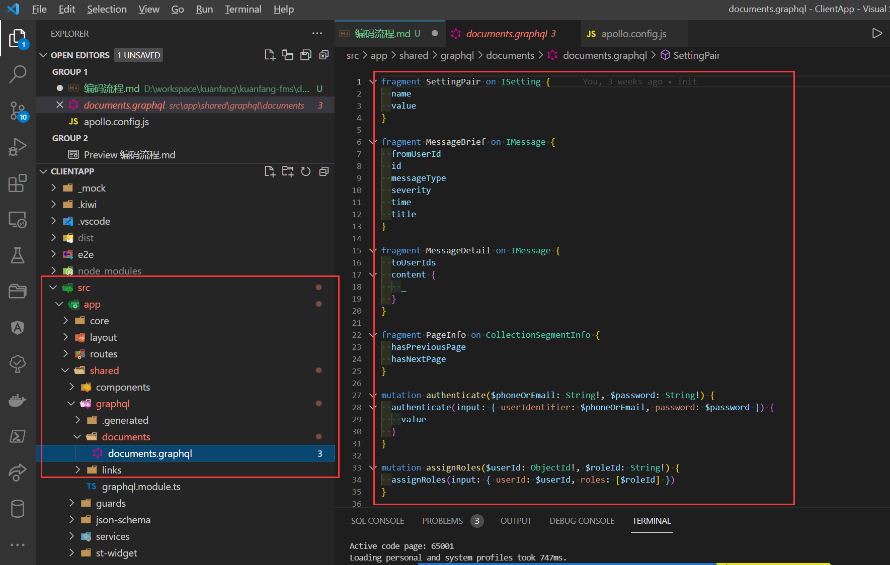
                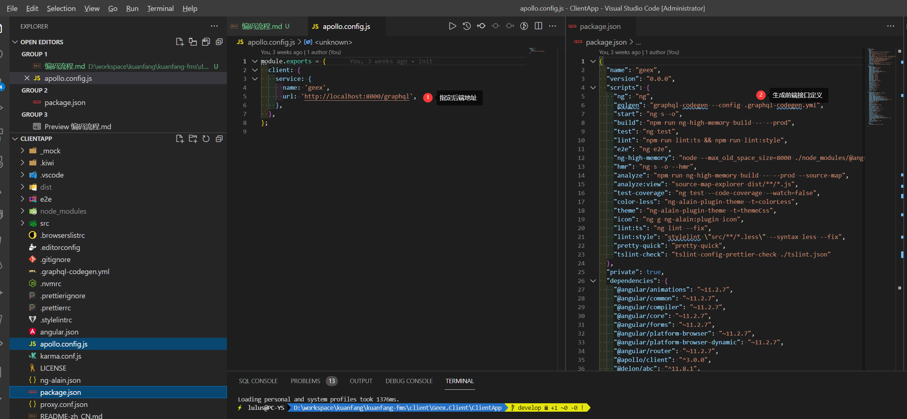
                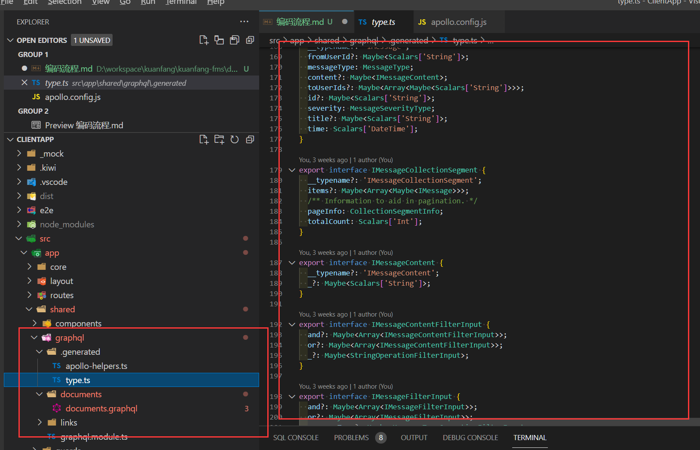
            - 使用前端代理
                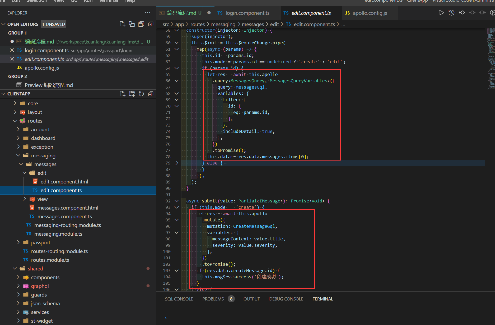
        - 相关开发及调试工具
            - vscode及相关插件(参见`前端项目目录/.vscode/extension.json`)
            - 谷歌浏览器及[Store调试插件](https://chrome.google.com/webstore/detail/redux-devtools/lmhkpmbekcpmknklioeibfkpmmfibljd)
- 环境依赖(可以使用项目根目录下的`dev_env.ps1`脚本一键启动环境[不包含elasticsearch])
    - mongo(需配置replica, 默认端口27017), 如需配置多实例, 参考[这篇文章](https://blog.csdn.net/wang805447391/article/details/86538538)
    - redis(默认端口6379)
    - dotnet 5.0以上
    - yarn
    - node 14+
    - elasticsearch(可选, 默认端口9200)
- 相关文档:
    - graphql的使用
        - 数据结构浏览: http://localhost:8000/voyager/
        - subscription测试: http://localhost:8000/playground/
        - 一般接口测试: http://localhost:8000/graphql/
        - 官方文档: https://graphql.cn/learn/
    - mongodb的使用及相关基础概念
        - 官方文档: https://www.runoob.com/mongodb/mongodb-query.html
- 关于测试驱动开发流程
    1. 后端定义接口
    2. 前端根据schema开始定义client
    3. 后端编写该功能基础测试用例并实现逻辑, 保证测试通过
    4. 后端提交时保证测试正确
    5. 其他测试相关写法参考项目已有测试用例

- DDD相关开发流程说明
    1. 构造函数仅处理赋值类操作, 如果有逻辑, 统一使用Class.New()的工厂方法
        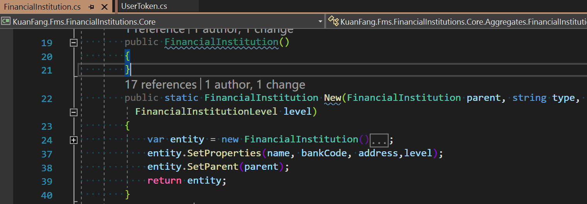
    2. 关于`Entity.Do()`和`IMediator.Send(DoRequest)`
        1. 能够拿到Entity的(通过QueryInput), 优先考虑走`Entity.Do()`
            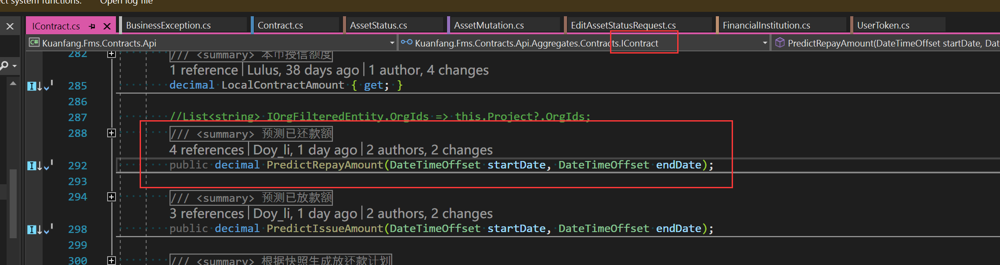
        2. 不能够拿到Entity的(通常不是针对特定对象的方法, 比如查询), 走`IMediator.Send(DoRequest)`
             
    3. 不要额外定义Dto, 通过gqlType配置, 直接返回entity对象或其他领域层对象, 如果是报表等对象, 也是返回包含逻辑的领域层对象
    4. 关于对象在不同领域的, 提取接口, 拆分PartialClass
        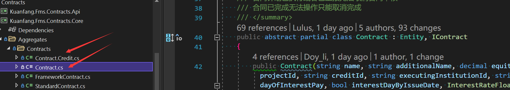
        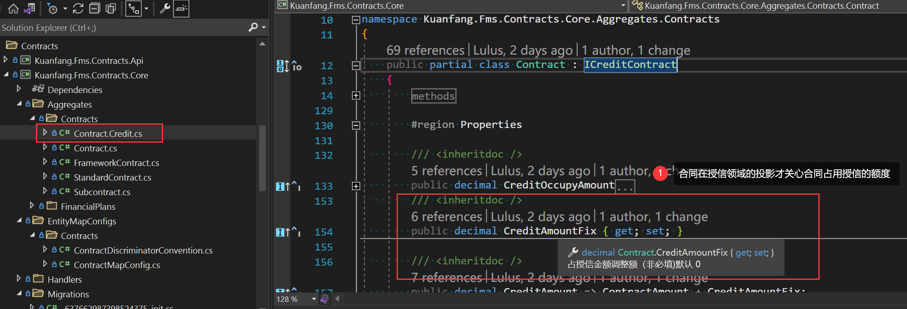
    5. 业务模块代码抛出BusinessException, `GeexExceptionType`可以在本模块进行继承扩展成如`ContractBusinessExceptionType`以增加其他有预定逻辑处理的异常类型
        `throw new BusinessException(GeexExceptionType.Conflict, message: "还款或利息已上报或审批不允许进行此操作.");`
    6. 关于`DB`和`DbContext`
        1. `DB`对象默认不受事务约束, `DbContext`自带事务
        2. 关于`DbContext.Queryable`和`DbContext.Find`
            1. `DbContext.Queryable`查询使用内存缓存数据, 支持uow, 不需要手动调用Save, 查询性能相对较低
            2. `DbContext.Find`查询不使用内存缓存, 不支持uow, 需要手动调用Save, 查询性能高
- 思想上的转变
    - 如果没有必要, 不要新增实体
        - 基于对象的逻辑总是优于基于流程的逻辑:`合同.上报()`>`合同Service.上报(合同)`>`Mediator.Send(上报合同Request(合同))`
        - 功能尽量内聚, 能用Entity解决的就用Entity解决, 不要引入新的概念, 比如Service/Mediator(Request)
        - 实在不能内聚的`无Entity行为`(查询/创建其他领域的对象等), 提取到Service/Mediator
        - Mediator>Service是因为Mediator只有一个, 而Service会有很多个
    - 记忆通用逻辑很简单, 记一个特殊逻辑很难
        - `dbContext.Find<子合同>()`>`dbContext.Find<合同>().Where(x=>x.合同分类 == 子合同)`
            - 前者破坏小, 不影响原有逻辑, 可以递归扩展(假如出现了`子子合同`, 前者继续查子合同, 后者则是`合同分类 == 子合同||合同分类 == 子子合同`)
            - 前者可以在子合同重写方法, 不会扩张合同的逻辑, 后者则扩张合同逻辑, 合同内业务复杂度指数级上升一级
            ``` C#
            合同.上报(){检查()修改()}=>合同.上报(){检查()修改()}
                                    子合同.上报(){修改()更新框架合同()}
            
            合同.上报(){检查()修改()}=>合同.上报(){
                                                    if(子合同){
                                                        修改()更新框架合同()
                                                    }
                                                    else{
                                                        检查()修改()
                                                    }
                                                }
            // 试想如果有一天修改逻辑也有变更呢? 
            // 在修改逻辑里面嵌套写if的话, 复杂指数再上升一级
            // 所以尽量不要把不同的对象通过特殊逻辑串起来
            ```
    - 领域
        - 合同领域
            - 授信(授信在合同领域的投影, 它和授信存在同一个表, 但不是授信的概念, 不具备授信的全部功能)
        - 授信领域
            - 合同(合同在授信领域的投影, 它和合同存在同一个表, 但不是合同的概念, 不具备合同的全部功能)
